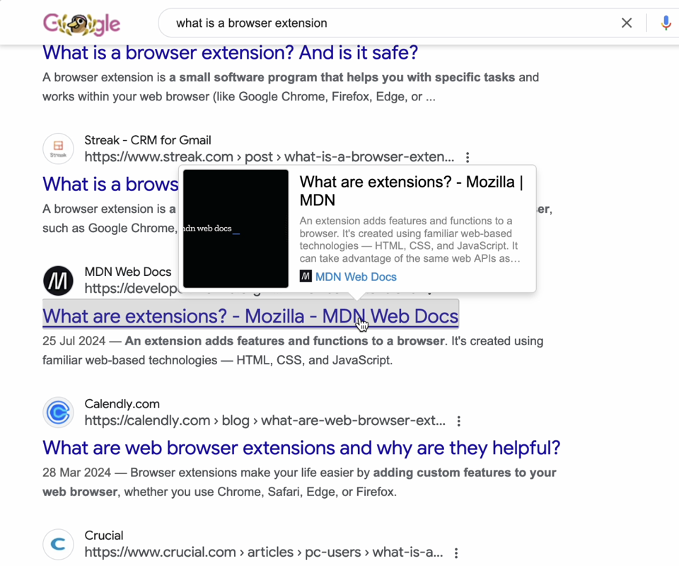
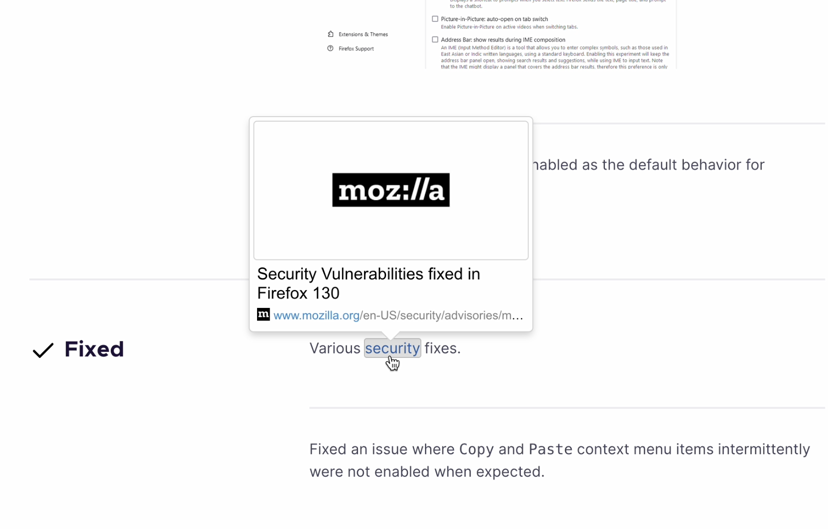
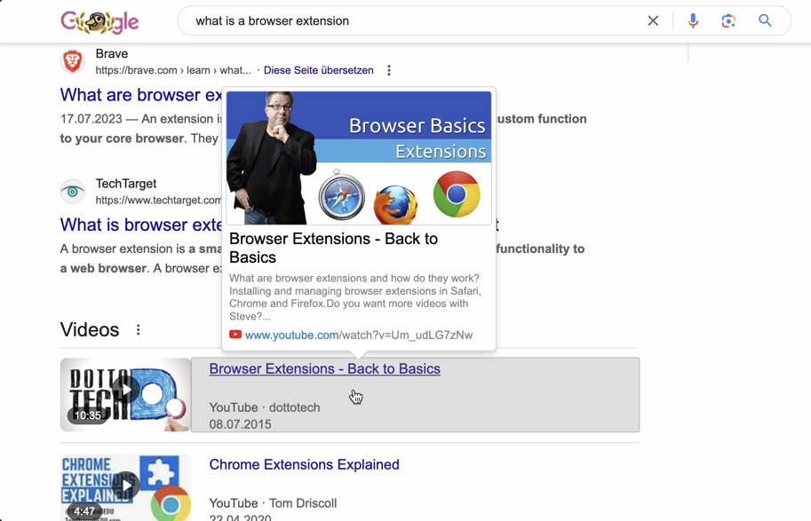
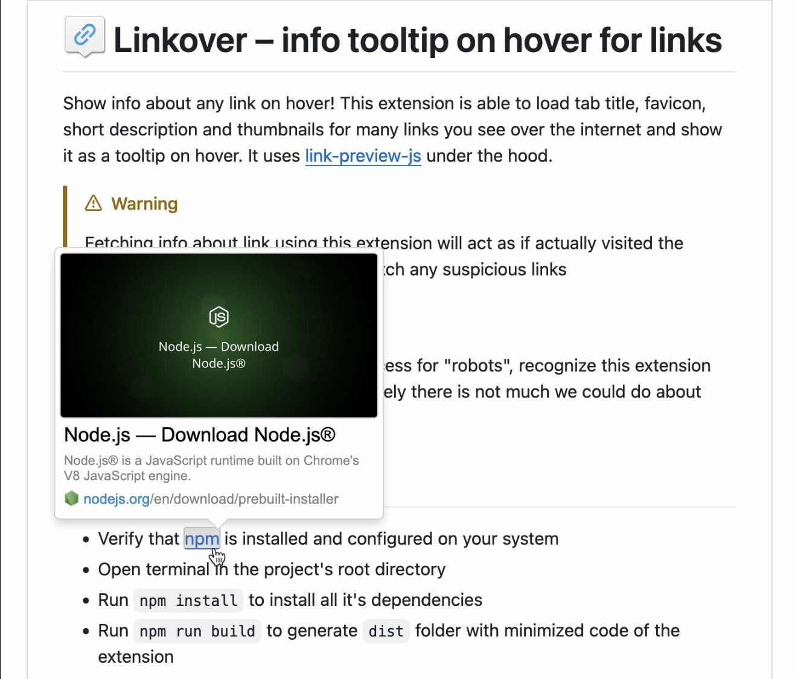

#  Linkover – info tooltip on hover for links

Show info about any link on hover! 
This extension is able to load tab title, favicon, short description and thumbnails for many links you see over the internet and show it as a tooltip on hover. It uses [link-preview-js](https://www.npmjs.com/package/link-preview-js) under the hood.

> [!WARNING]\
> Fetching info about link using this extension will act as if actually visited the page! It is recommended to not prefetch suspicious links. Although browser history will not get populated with these pages, no worries.

    
More screenshots

    
    
    

## Support
If you really enjoy this project, please consider supporting its further development by making a small donation using one of the services below! 

 &nbsp;  &nbsp; 

## Building
- Verify that [npm](https://nodejs.org/en/download/prebuilt-installer) is installed and configured on your system
- Open terminal in the project's root directory
- Run `npm install` to install all it's dependencies
- Run `npm run build` to generate `dist` folder with minimized code of the extension

## My other browser extensions
* [Selecton](https://github.com/emvaized/selecton-extension) – smart text selection popup
* [Circle Mouse Gestures](https://github.com/emvaized/circle-mouse-gestures) – mouse gestures with visual representation of all available actions
* [Google Tweaks](https://github.com/emvaized/google-tiles-extension) – set of tweaks for Google search page to make it easier to use
* [Open in Popup Window](https://github.com/emvaized/open-in-popup-window-extension) – quickly open link or image in a popup window with no browser controls